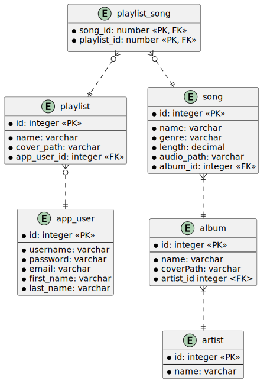
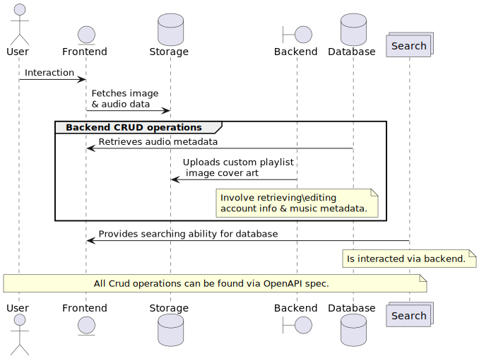

# README

## About project
Please read more about this through here on my personal website: [rarlog.me](https://rarlog.me/projects/#music-play).

## To run

Docker is needed to run this program.

```bash
git clone https://github.com/thisisnotruben/music_play; \
docker compose up -d; \
xdg-open http://localhost:8443;
```

Login to `http://localhost:8443` with:
- username: `admin`
- password: `admin123`

### API Docs
Backend application needs to be running to view links
- [Swagger UI](http://localhost:8080/swagger-ui/index.html)
- [Open API JSON](http://localhost:8080/v3/api-docs)
- [Open API YAML](http://localhost:8080/v3/api-docs.yaml)

### Connect to database
password: `admin123`
```bash
docker exec -it database psql -h localhost -p 5432 -d music_play -U admin
# Ex:
# SELECT * FROM app_user;
# \quit
```
Entities in diagram below to query.

## TODO
- Security
- Explore feed
- Scroll size of main content
- response validation when sending data to backend
- favicon

## Diagrams
### Entity diagram


### Flow diagram
